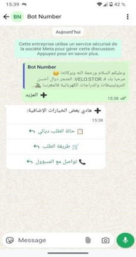
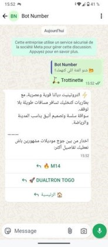
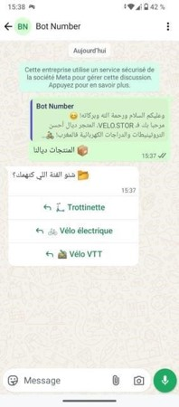
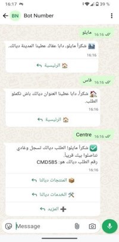
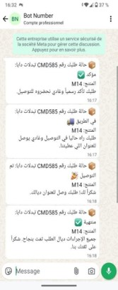

# WhatsApp AI Bot with Python & Flask 

<h1 align="center">
  
</h1>

This project demonstrates how to build a WhatsApp bot using the **Meta (Facebook) Cloud API**, **Python**, and **Flask**.  
The bot supports real-time messaging via webhooks and can generate **AI-powered responses using OpenAI**.

This guide walks you **step-by-step**, from initial setup to AI integration, just like an official tutorial.

---

## 📸 Screenshots

<p align="center">
  
  
  
  
  
</p>

👉 **[View all screenshots](./screenshots)**

---

## 🔗 Integration with VELO STOR
The WhatsApp bot developed in Python using the Meta WhatsApp Cloud API is connected to VELO STOR.

- **👉 Link to the VELO STOR store (demo/testing purposes):** https://github.com/Nexus-Vertex/.-VELO-STOR-Online-Store-Web-Project

### The bot enables:
- **Presentation of store products**
- **Navigation using conversational logic**
- **Automated customer responses**
- **Simulation of a WhatsApp-based customer service experience**

## 📑 Table of Contents
- [Prerequisites](#prerequisites)
- [Project Structure](#project-structure)
- [References](#references)

---

## Prerequisites
Before starting, make sure you have:
- **Meta Developer Account**  
  👉 https://developers.facebook.com/
- **WhatsApp Business App**  
  👉 https://developers.facebook.com/apps/
- **Python 3.10+** installed on your system  
  👉 https://www.python.org/downloads/
- Basic knowledge of **Python**, **Flask**, and **HTTP APIs**

---

## Project Structure
Recommended project structure:
```bash
whatsapp-bot/
├── webhook.py       # Main file to start Flask server
├── requirements.txt # Python dependencies
├── utils.py         # Functions to handle WhatsApp messages
├── update_excel_realtime.py # Functions to update Excel in real-time
├── database.db      # (Optional) SQLite database
├── .env             # Environment variables
└── README.md        # Documentation
```

---

## References
- **WhatsApp Cloud API**
👉 https://developers.facebook.com/docs/whatsapp
- **OpenAI API**
👉 https://platform.openai.com/docs
- **Ngrok**
👉 https://ngrok.com/docs
- **YouTube Tutorials**
👉 https://www.youtube.com/@daveebbelaar

## Hinweis
Dieses Projekt wurde eigenständig entwickelt, um grundlegende und praxisnahe Kenntnisse in den Bereichen
Softwareentwicklung, Python, APIs, Webhooks und Backend-Logik zu demonstrieren.

Die im Projekt verwendeten Beispiele und Produkte wurden bewusst ausgewählt, um verschiedene Funktionen, Abläufe und technische Konzepte praktisch zu testen und zu verstehen. Sie dienen ausschließlich Lern- und Demonstrationszwecken.

Der Fokus liegt nicht auf einem marktreifen Produkt, sondern auf dem Verständnis technischer Zusammenhänge, einer klaren Projektstruktur sowie einer nachvollziehbaren und sauberen Implementierung.

Dieses Repository stellt einen praktischen Nachweis meiner Motivation, Eigeninitiative und technischen Grundlagen dar.

# This project is part of a series of practical experiments, including:
- **VELO STOR – Online Store:** 👉 https://github.com/Nexus-Vertex/.-VELO-STOR-Online-Store-Web-Project
- **Anomaly Detection Program:** 👉 https://github.com/Nexus-Vertex/Anomaly-Detection-System
